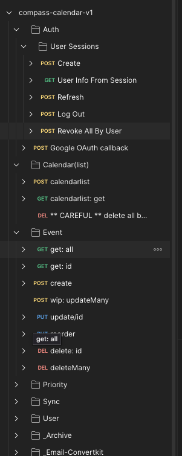

# Test

This doc explains how to run tests locally. For information on writing tests, see the [Testing Guide](../contribute/testing-guide.md).

## Automated Testing

### How to run tests locally

Use these commands from the root directory to run the unit and integration tests locally:

```bash
yarn test           # runs all tests

yarn test:web       # runs web tests

yarn test:backend   # runs backend tests

yarn test:core      # runs core tests
```

### Our Testing Strategy

Glossary:

- Unit Tests: Verify individual functions and components
- Integration Tests: Test interactions between components
- E2E Tests: Simulate user interactions
- Manual Tests: Test in development environment

| Test Type         | Area under test  | Tool                                             |
| ----------------- | ---------------- | ------------------------------------------------ |
| Unit Tests        | Core logic       | Jest                                             |
| Unit Tests        | React components | Jest + React Testing Library                     |
| Unit Tests        | React hooks      | Jest + React Testing Library (hooks)             |
| Integration Tests | API              | Jest + In-memory MongoDB (`@shelf/jest-mongodb`) |
| Manual Tests      | API              | Postman                                          |
| Manual Tests      | UI               | Manual in browser                                |
| E2E Tests         | n/a              | n/a                                              |

The GitHub repository is configured to run tests automatically via CI/CD after every push to ensure code quality.

## Manual Testing with Postman

I've created a Postman collection that I use to test the API.

However, I haven't cleaned it up for public use yet.

If this would be helpful, please let me know by creating a GitHub issue or upvoting the existing one.



### Debug routes

These routes are exposed when in dev for debugging purposes. They are not available in production.

| Area                       | Request                                                    |
| -------------------------- | ---------------------------------------------------------- |
| Simulate Gcal notification | `curl -X POST http://localhost:3000/api/event-change-demo` |
