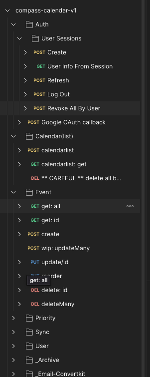

# Test

This doc explains how to run tests locally. For information on writing tests, see the [Testing Guide](../contribute/testing-guide.md).

## Automated Testing

### Start with the Smallest Relevant Check

Most changes do not require the entire test suite. Start with the smallest command that covers your change, then widen only if the change crosses package boundaries.

Use these commands from the repo root:

```bash
yarn test:web       # web UI and interaction tests
yarn test:backend   # backend route and service tests
yarn test:core      # shared domain logic tests
yarn test:scripts   # CLI, migrations, and script tests
yarn type-check     # repository-wide TypeScript check
yarn test:e2e       # Playwright end-to-end flows
```

Use `yarn test` only when you explicitly want the full Jest suite.

### What to Run

- **Web-only UI change**: `yarn test:web`
- **Backend route or service change**: `yarn test:backend`
- **Shared types or business logic**: `yarn test:core`
- **CLI, migration, or seeder change**: `yarn test:scripts`
- **Cross-cutting changes**: combine the relevant commands and add `yarn type-check`
- **Critical user flows**: add `yarn test:e2e`

### Our Testing Strategy

Glossary:

- Unit Tests: Verify individual functions and components
- Integration Tests: Test interactions between boundaries in the app
- E2E Tests: Simulate user interactions
- Manual Tests: Test in the development environment

| Test Type | Area under test | Tool |
| --------- | ---------------- | ---- |
| Unit Tests | Core logic | Jest |
| Unit Tests | React components and hooks | Jest + React Testing Library |
| Integration Tests | Backend APIs and service boundaries | Jest |
| Manual Tests | Local development flows | Browser + API requests |
| E2E Tests | User workflows | Playwright |

CI runs unit and end-to-end coverage separately, so local development is usually fastest when you mirror that targeted approach instead of defaulting to every test on every change.

## Manual Testing with Postman

For backend debugging, start with direct local requests before reaching for a larger collection. A simple health probe is often enough to confirm whether the backend is up and talking to MongoDB:

```bash
curl -i http://localhost:3000/api/health
```



### Debug routes

These routes are exposed when in dev for debugging purposes. They are not available in production.

| Area                       | Request                                                    |
| -------------------------- | ---------------------------------------------------------- |
| Simulate Gcal notification | `curl -X POST http://localhost:3000/api/event-change-demo` |
