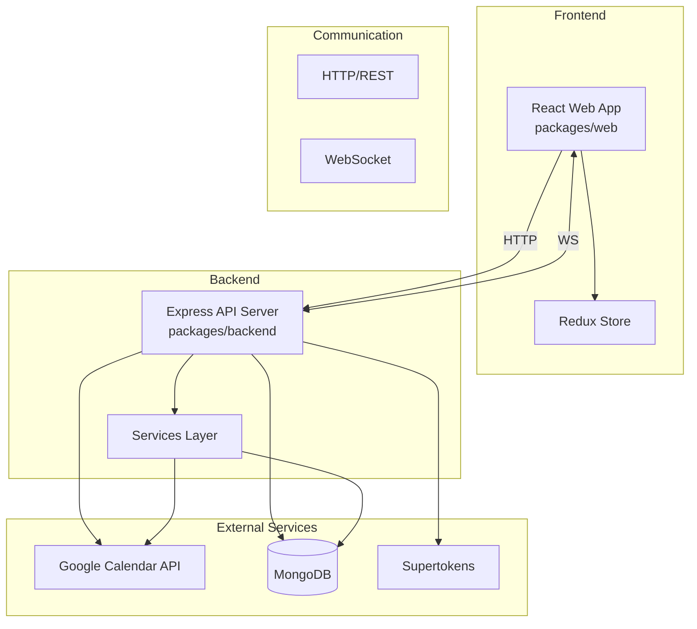
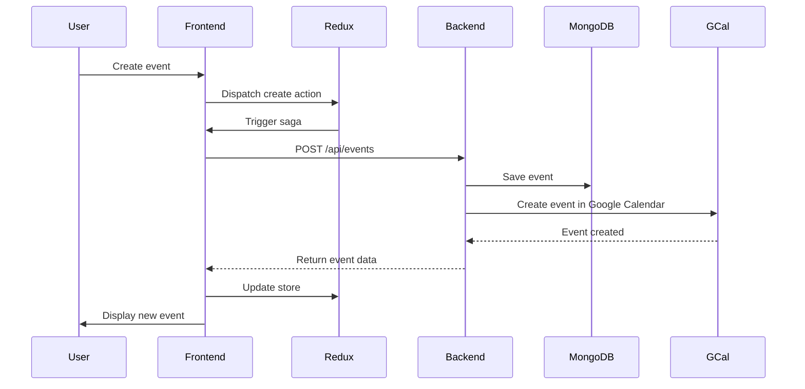
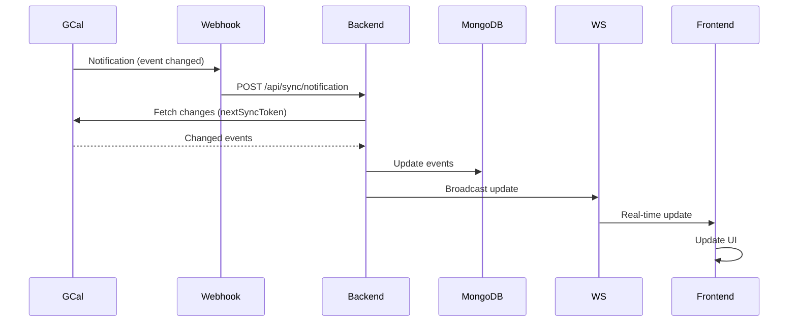

# System Architecture

This document provides an overview of the Compass system architecture, including package structure, data flows, and key components.

## High-Level Overview

Compass is a monorepo application that synchronizes calendar data between a React frontend and Google Calendar via a Node.js backend. The system uses MongoDB for data persistence and WebSockets for real-time updates.



## Package Structure

Compass is organized as a monorepo with the following main packages:

### `packages/backend`

The Node.js backend API server that handles:

- User authentication and session management (Supertokens)
- Google Calendar API integration
- Event synchronization logic
- WebSocket connections for real-time updates
- Database operations (MongoDB)

**Key directories:**

- `src/controllers/` - Request handlers
- `src/services/` - Business logic
- `src/models/` - Database models/schemas
- `src/routes/` - API route definitions
- `src/middleware/` - Express middleware

### `packages/web`

The React frontend application that provides:

- Calendar UI (day/week/month views)
- Event creation and editing
- Task management (Someday list)
- Real-time updates via WebSocket
- Redux state management

**Key directories:**

- `src/components/` - React components
- `src/ducks/` - Redux slices and sagas
- `src/store/` - Redux store configuration
- `src/hooks/` - Custom React hooks
- `src/utils/` - Utility functions

### `packages/scripts` (CLI)

Command-line tools for development and deployment:

- Building the application for production
- Managing user data (deleting test users)
- Environment-specific builds

### `packages/core` (if exists)

Shared code used by both frontend and backend:

- Type definitions
- Utility functions
- Constants

## Data Flow

### Event Creation Flow



### Sync Flow (Google Calendar → Compass)



## Authentication Flow

Compass uses a two-layer authentication system:

1. **Compass Authentication**: Managed by Supertokens

   - User sessions
   - Access/refresh tokens
   - Session cookies

2. **Google Calendar Authentication**: OAuth 2.0
   - Google access tokens
   - Google refresh tokens
   - Stored per user in MongoDB

See [Authentication + Syncing](./auth-sync.md) for detailed authentication flows.

## Database Schema

MongoDB collections:

- **users**: User accounts and Google OAuth tokens
- **events**: Calendar events
- **syncs**: Google Calendar sync channel information
- **calendarlist**: User's Google Calendar list
- **priorities**: User-defined event priorities
- **sessions**: Supertokens session data

## WebSocket Communication

WebSockets are used for real-time updates when:

- Events are synced from Google Calendar
- Events are created/updated/deleted by other clients
- User sessions change

The backend broadcasts updates to all connected clients for a user.

## Key Technologies

- **Frontend**: React, TypeScript, Redux, Redux Saga, Styled Components, TailwindCSS
- **Backend**: Node.js, Express, TypeScript, Socket.io
- **Database**: MongoDB (via Node.js driver)
- **Authentication**: Supertokens (sessions), Google OAuth 2.0
- **Build Tools**: Webpack, Babel
- **Testing**: Jest, React Testing Library
- **Package Management**: Yarn (with Lerna for monorepo)

## Development vs Production

### Development

- Hot reloading enabled for both frontend and backend
- Development server on `localhost:9080` (web) and `localhost:3000` (API)
- Source maps enabled
- Detailed error messages

### Production

- Compiled JavaScript (TypeScript → JavaScript)
- Optimized bundles
- Environment-specific configuration (`.env.production`)
- Static assets served via Nginx or similar
- Backend runs as Node.js process (often with PM2)

## Deployment Architecture

```text
┌─────────────┐
│   Nginx     │  ← Serves static files, handles SSL
└──────┬──────┘
       │
       ├──→ Static files (React build)
       │
       └──→ Reverse proxy → Node.js API (port 3000)
                    │
                    ├──→ MongoDB
                    ├──→ Google Calendar API
                    └──→ Supertokens
```

## For More Information

- [Frontend Data Flow](./data-flow.md) - Detailed Redux/React data flow
- [Authentication + Syncing](./auth-sync.md) - Auth and sync implementation details
- [Recurring Events Overview](./recurring-events-overview.md) - How recurring events work
- [Error Handling](./error-handling.md) - Error handling patterns
