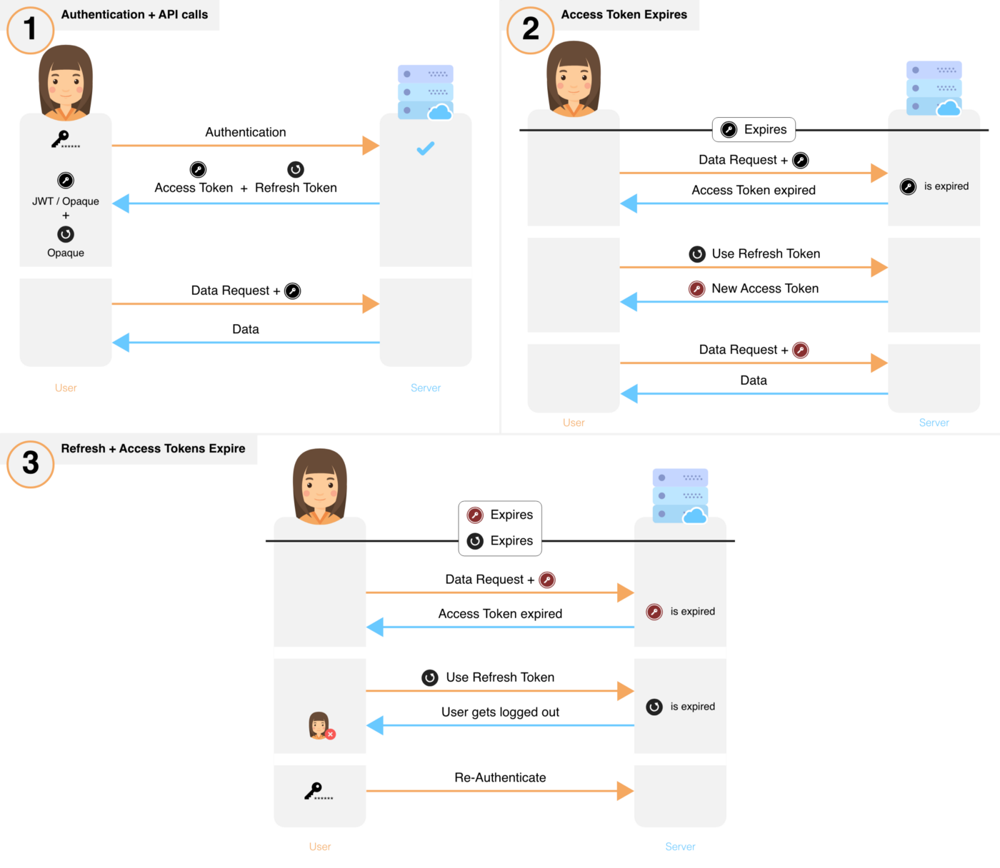

Handling authentication and syncing between Compass and Google Calendar was the trickiest part of the project. Hopefully this helps you understand how it all works

## How Auth & Sync Work

### Auth + Sync Vocabulary

#### Auth Terms

| Name          | Related to | Source       | Summary                                                                                                                                  |
| ------------- | ---------- | ------------ | ---------------------------------------------------------------------------------------------------------------------------------------- |
| gAccessToken  | gAPI       | OAuth2Client | auths G’s oAuthClient                                                                                                                    |
| gRefreshToken | gAPI       | OAuth2Client | ensures a compass user is always able to get gAccessToken and auth to the gAPI                                                           |
| accessToken   | auth       | superTokens  | JWT that verifies Compass user is authenticated and is only changing their data. Outsourced to supertokens (sAccessToken)                |
| id token      | auth       | OAuth2Client | correlates Google user with Compass user [Google ID Token](https://developers.google.com/identity/gsi/web/guides/verify-google-id-token) |
| refreshToken  | auth       | superTokens  | JWT that enables auto-refreshing accessToken. Currently outsourced to superTokens (sRefreshToken)                                        |
| session       | auth       | superTokens  | server-side user session (managed by superTokens) , used to securely validate + transfer access+refresh tokens between front+backend     |
| Super Tokens  | auth       | superTokens  | library for managing sessions [Super Tokens](https://supertokens.com/docs/session/common-customizations/sessions/new-session)            |
| (csrf) state  | gOauth     | uuid         | verifies user initiated auth (not hacker)                                                                                                |

#### Sync Terms

| Name          | Source  | Summary                                                                                                                              |
| ------------- | ------- | ------------------------------------------------------------------------------------------------------------------------------------ |
| expiration    | gAPI    | when notification channel expires. Origin: calendarlist.watch()                                                                      |
| resourceId    | gAPI    | identifies a G Cal resource. Origin: calendarlist.watch()                                                                            |
| calendarId    | gAPI    | identifies a user’s Google (sub)calendar. Each sub calendar has a different calendarId. Origin: calendarlist.list()                  |
| nextSyncToken | gAPI    | helps G Cal know how many things changed for a resource since last sync. Origin: sync notification                                   |
| channel token | Compass | a secret string that only Compass + Gcal know. Helps validate that a notification is from Gcal, and not hacker                       |
| channelId     | Compass | identifies a specific watch (AKA notification channel) for a specific G Cal resource (calendar events, user settings, calendarlists) |

## WebSocket Flow

View the diagram and description from [this compass PR](https://github.com/SwitchbackTech/compass/pull/126)

## Auth Flows

Legend:

> F - frontend

> B - backend

## Signup / Sign in

- Context
  - why using “authorization code” flow (vs “implicit”)
    Compass uses the “code authorization” flow
    - why: cuz allows offline refreshing of tokens via refresh tokens [link](https://developers.google.com/identity/oauth2/web/guides/how-user-authz-works#oauth_20_flows)

Getting permission from a (real) user

1. F: creates `csrfState` value and saves (as React Ref)
   - (Other ways to do it if ^ breaks)
     1. via server session: state saved in session, then backend validates it against hash and secret
     2. via JWT:
2. User: clicks Google Sign In button
3. F: opens oauth modal, using auth URL+params from `@react-oauth`
   - params include
     - `offline`access (for auto-refreshing tokens)
     - list of requires `scope`s (profile, email, calendar, etc)
4. User: grants permissions

Verification

1. Google: sends back `code` , `csrfState`, `scopes`
2. F: confirms request initiated by real user (not hacker) by validating that the `csrfState` from Google matches the one in React’s memory
3. F: confirms user granted all necessary scopes/permissions

User setup

1. F: sends `code` to backend
2. B: exchanges code for `access_token`,( `refresh_token)` ), `id_token`
   1. always returns active `access_token` by using the `refresh_token` to get a new one if the existing one is expired
3. B: persists `refresh_token`

   - there is only ever one `refresh_token` (upon signup) — it doesn’t expire or rotate

     > - Be sure to store the refresh token safely and permanently, because you can only obtain a refresh token the first time that you perform the code exchange flow.

     - There are limits on the number of refresh tokens that are issued: one limit per client/user combination, and another per user across all clients. If your application requests too many refresh tokens, it may run into these limits, in which case older refresh tokens stop working.

     - [link](https://developers.google.com/identity/protocols/oauth2/openid-connect#refresh-tokens)
       >

4. B: Checks if user exists
   1. by decoding `id_token`, getting the user’s google id, and checking if any matching record exists in Compass’ `oauth` collection
5. B: If user not exists, **signs user up**:
   1. imports G Cal events, saving `origin` as `googleimport`
   2. B: creates default Compass data (`priority`, `calendarlist`, etc)
   3. B: Sets up sync
   4. B: saves signup timestamp in `user` collection
   5. B: returns summary
6. B: If user exists, **logs user in**:
   1. Checks notification channel watch status for user’s events
      1. if none exist: starts new
      2. If watch is expired: refreshes it
   2. B: does incremental sync for events
      1. does this regardless if a watch is already active to ensure user sees most up-to-date data upon login
   3. B: saves login timestamp in `user` collection
   4. B: returns summary

Finalize Auth

1. B: create server session for user via `supertokens`, which attaches access+refresh tokens to user’s cookies and persists in their DB | [ [link](https://supertokens.com/docs/session/common-customizations/sessions/new-session) ]
2. F: if successful response:
   1. saves/updates cookies based on response

Updates UI

1. F: if failed: displays error & keeps user at login

## Validating User Requests

For a step-by-step guide on how to create a user session and attach the access token to subsequent requests, see [this issue](https://github.com/SwitchbackTech/compass/issues/508)

What happens when a user makes a change in Compass

1. User makes a change in Compass
2. F: verifies user session exists (via `supertokens` [ [link](https://supertokens.com/docs/session/common-customizations/sessions/checking-session-front-end) ])
3. F: sends request to backend
4. B: verifies user session via `supertokens` middleware [ [link](https://supertokens.com/docs/session/common-customizations/sessions/session-verification-in-api/verify-session) ]
   - session verification stuff you’ll have to do manually is nixing `supertokens`
     1. B: …. checks if `accessToken` & `refreshToken` still active
        1. B: if `refreshToken` not active, throws `code` error
           1. F: forces user to re-auth
        2. B: if `accessToken` expired but `refreshToken` still active:
           1. gets new `accessToken` & `refreshToken` via `/api/auth/refresh` endpoint
           2. deletes old and saves new `accessToken` & `refreshToken` in `user` collection (so no lingering `refreshTokens`)
           3. B: sends `accessToken` & `refreshToken` to Frontend
           4. F: saves new tokens ….
              1. via axios interceptors + headers | [guide](https://www.bezkoder.com/axios-interceptors-refresh-token/)
        3. …. checks if `refreshToken` is active. updates if not..
           1. \*\* decide if y
     2. B: …. tells Frontend to update its `access|refreshToken`
     3. F: updates `access|refreshTOken` in `localStorage|session`
5. B: gets active `accessToken` (`OAuth2Client.getAcessToken()`) for gApi
6. gets `gcalClient`
   1. B: inits `Oauth2Client` credentials with the user’s `gRefreshToken`
   2. B: passes `Oauth2Client` to `google.calendar`
   3. _(B: future: saves user’s `gcalClient` in cache)_
7. B: Makes the request Gcal, Ccal changes
8. B: Makes the requested change
   1. if changing an `event`, always updates the `lastUpdated` field, which is important for preventing duplicate sync events
9. B: Returns response (including session info)
10. F: Display change / error

## Logout

1. U: clicks Sign Out button or goes to `/signout`
2. F+B: revokes session via `supertokens` [ [link](https://supertokens.com/docs/session/common-customizations/sign-out) ]
3. F: tells B to stop watching event channels for user
4. B: tells Google to stop watching for user

## Refreshing Gcal Tokens | 400 `invalid_grant`

- the issue: the `user.google.gRefreshToken` expires (after 7 days in dev)
  - that token is required for google api requests
  - the user needs to re-auth with google oauth to update it
- how it’s handled
  - express middleware sees 400 error
  - revokes session
  - frontend sees revoked session, sends user back to login
  - during login, code checks if refresh token is different
  - if so, it updates the `user.google.gRefreshToken` value
- how to replicate an expired `gRefreshToken`
  - revoke session, logging user out
  - when logging in, update their refresh token — add a `Z` to the end of it manually via MongoDB

## Sync Flows

## Initing the Sync

### How to tell Google to keep you in the loop

This currently creates a sync for all events in user’s `primary` calendar. But this same flow can be repeated when ready to sync Gcal `settings` and Gcal `calendarlists`

1. B: gets the data it needs
   1. calls a `[Resource].list()` to get it’s the `nextSyncToken` (eg. `events.list()` or `settings.list()`)
2. B: tells GCal to notify us whenever an event on user’s (primary) sub calendar changes
   1. sends request to `.watch()`, including `channelId`, channel token, webhook callback URL
      - webhook needs to be open to google (if not public)
      - request includes our own `expiration`, which eases renewals
3. G Cal: agrees, confirming with a `sync` message and providing Compass with `channelId`, `resourceId`, `expiration`
4. B: saves that info in the `sync` collection

PS: we’re not doing an incremental sync, because currently the only way a sync channel is setup is during signup, which requires a full sync anyway.

## Handling Sync Notifications (GCal → CCal)

### What happens when Google notifies Compass about a change to a user’s GCal

1. F: makes request
2. B: validates that it came from google via the channel token
3. If it’s existing sync:
   1. B: check for last time user signed in / used Compass
   2. if it’s been a while (x days), cancels the sync and exits
4. B: identifies user (by their `resourceId` in `calendarList`)
5. B: identifies calendar (from all their calendars in `calendarList` via `resourceId`)
6. B: identifies `google.nextSyncToken` (by their `calendar` id)
7. B: does incremental update:
   1. gets updated events (via `nextSyncToken`)
   2. saves new `nextSyncToken` (in `sync` collection)
   3. uses updated events to decide which to update, delete, ignore
8. Saves `lastUpdatedAt` timestamp in `sync` collection
9. B: notifies frontend about change via websocket
10. B: Keeps this user’s sync alive & accurate by going through pruning flow

- I have more docs about what the pruning flow is. If you get this far and you'd find them useful,please open an issue

## Handling 410 Gone Response

What happens when you’re handling user requests, using `nextSyncToken`s to get the latest data, and Google tells you that the sync token isn’t valid anymore via 410 status code [ [link](https://developers.google.com/calendar/api/guides/sync#full_sync_required_by_server) ]

- this happens when a user revokes access to Compass via their Google Workspace account
- Each Compass event service call that depends on gAPI auth (create, update, delete) is wrapped in an error handler (in controller) that checks for a 400/410 thrown error
- if is, it re-syncs the google data (deletes, re-imports, re-initializes the sync)

How to replicate 410 error:

- Login / sign up
- Change the user’s `sync.nextSyncToken` by adding a `1` or `Z` to the front
  - This will force Google to throw the 410 error, because it looks similar to their token format, but isn’t an actual match
- Either make a change in Compass or GCal to see how this is handled

## Maintaining Syncs

### The Business Logic

Goals

1. prevent unnecessary syncing between CCal & GCal when:
   - user revoked CCal’s access to their GCal
     - user hasn’t used CCal in a while, and assumedly doesn’t plan to use it or pay for it in short-term
   - the gcal’s `gRefreshToken` expired, because it wasn’t used for 6 months [ [link](https://github.com/googleapis/google-api-nodejs-client#handling-refresh-tokens) ]
2. Keep the syncs active for people using Compass

### How

Backend:

1. Checks for stale watches on a regular basis
2. Gets all watches that’ll expire within [x] days
3. Filters by the ones whose Compass users haven’t signed in for [y] days
   1. Tells GCal to stop the notification channel for those resources (events) for those users
   2. revokes session (or will they already be long-since revoked? What’s supertokens default session life?)
4. B: Gets the ones whose Compass users are still active
   1. Refreshes the watch — stops the current, creates a new one
   2. Does preemptive sync/import of events

### Cases

```jsx
1. inactive sync → ignore

2. stale user →

 a. existing sync → prune

 b. sync data gone (cuz previous pruned) → ignore

3. active user →

 a. active syncs → event syncs don’t expire soon → ignore

 b. event syncs expired / expire soon → refresh
```

### Automating it

- High-level flow
  - A scheduled job trigger a cloud function
  - The cloud function sends a HTTP request to `/sync/maintenance` on the backend(s)
  - The cloud function parses the backend’s response
    - if there was an error, it sends an email to Tyler
- Create Google Cloud Function to call Compass backend

  - Manually test the function

    - notice the `\`s in the URL — you need this if calling from the CLI
      - but don’t include `\`s when creating it in GCP scheduler
    - change the domain param based on the environment

    ```jsx
    curl -m 70 -X POST https://yourGCPURL\?domain=your.app.com\
    -H "Authorization: bearer $(gcloud auth print-identity-token)"
    ```

- Schedule Cloud Function using cron

  ```bash
  chmod +x /path/to/script.sh

  crontab -e

  0 0 * * * bash /path/to/script.sh
  ```

## References

Session Stuff

- Don’t refresh token prematurely:
  “You don’t have to refresh the token before it expires. If you did, you might logout people that have just had their browser closed. All you have to do is check the token expiry date before making a request. If it’s expired, call for a token refresh before continuing with the request.” | [reddit](https://www.reddit.com/r/reactjs/comments/c685s1/how_to_implement_with_reduxsaga_automatically/)
- Auto-refreshing token
  - [read this first](https://github.com/auth0/node-jsonwebtoken#refreshing-jwts)
  - how it could work
    - high-level [example](https://gist.github.com/ziluvatar/a3feb505c4c0ec37059054537b38fc48) by auth0
    - include a `refreshToken` alongside the token
      - salt and hash it (as is done in `demoCreateJWT` in [this commit](https://github.com/SwitchbackTech/compass-calendar/pull/177/commits/3190f9ab14a33d6e04f43aadc83d239b56121a30) and the [JWT Middleware demo commit](https://github.com/SwitchbackTech/compass-calendar/pull/177/commits/457985c9ccb345ad1ffa9cdea173dedce89b629a)
      - save it in the DB (?)
      - salt and hash the
    - enable `auth.controller.refreshJwt`
    - call ^ from the frontend whenever token expires
- How the app ensures userIds always the same
- How to ensure that the userid matches other collections even after the token has expired and change

Other

- JWT vs Server Session vs LocalStorage
  - JWT Refresh token guides
    - [js.plainenglish](https://javascript.plainenglish.io/expressjs-api-with-secure-jwt-access-and-refresh-token-64c5478be2c0)
  - ~~LocalStorage~~ - Don’t store sensitive stuff in LocalStorage | [link](https://dev.to/rdegges/please-stop-using-local-storage-1i04)
  - User session overview | [link](https://medium.com/hackernoon/all-you-need-to-know-about-user-session-security-ee5245e6bdad#dcc5)
- Event importing / syncing

- Using pagination [ [link](https://developers.google.com/calendar/api/guides/pagination) ]

- G Cal Sync Guide [ [link](https://developers.google.com/calendar/api/guides/sync) ]
- G Cal Push Guide [ [link](https://developers.google.com/calendar/api/guides/push) ]

- General Auth stuff

  - OpenId Oauth2 [[link](https://developers.google.com/identity/protocols/oauth2/openid-connect)]
  - google verification va anti-forgery state token | [link](https://developers.google.com/identity/protocols/oauth2/openid-connect#createxsrftoken) | [link2](https://developers.google.com/identity/gsi/web/guides/verify-google-id-token)
  - Access + Refresh Token Flow

    - a generic overview of how this usually works.

      

- Other approaches - for reference only - TBD
  - Prevent duplicate watches
    > Every time you perform a watch request, you should persist the data from the response, and check if the uuid or resource id already exist, if yes don't perform watch request for that resource id again (if you don't want to receive multiple notifications).
    - but doesn’t that prevent auto-renewals (cuz no temporary overlaps allowed)
  - Cron : Auto-clean channels
    - regularly check for expired tokens, rather than waiting for user to do it
      - eg every [x] days
        > RENEW:The channels do expire, so you need to update them once in a while. To do that create a crone in your server that is going to STOP all previous channels and it will create new one.
  - Overlapping watches (current)
    - if channel is going to expire soon, then create new watch
    - optional: clean redundant watch
      - if you renew a channel before it expires, you’ll have two active channels
      - so, call `stop` on the older channel so you only have one
  - idea: if they haven’t used / signed into Compass for [2 weeks], stop watching.
    - have them login again
    - do a 1-time incremental sync to get the most recent stuff
  - not a scheduled job — only happens when user makes request and the token is expired
  - might need to combine with a regular check of expired tokens, but don’t do that yet
- only the original Google user can stop watches
  • If the channel was created by a regular user account, only the same user from the same client (as identified by the OAuth 2.0 client IDs from the auth tokens) who created the channel can stop the channel.
- `gCalClient` and how to always get an active `gaccessToken`
  - … include link to that GH post that shows how to call `oauthClient.getAccessToken()`
  - works as long as your called `setCredentials` with the `refresh_token` that you saved from the initial login

token revoking | code POC [ [link](https://developers.google.com/identity/protocols/oauth2/web-server#offline) | [link2](https://developers.google.com/identity/protocols/oauth2/web-server#tokenrevoke) ]

---

## Prevent Duplicate Writes

How to prevent this scenario:

- User makes change in Compass
- Compass updates its event data in DB
- Compass updates event in user’s GCal
- GCal notifies Compass of change
- Compass re-updates the same event (with same data)

Don’t worry about it. Why:

- You can’t avoid the duplicate writing _without_ using Compass’ DB to check if it already has the event
  - Doing this would guarantee 2-3 requests (gcal.list() and that check), which is already more than just doing gcal.list() and triggering the update (2 max)
  - it just increases complexity of code
  - only revisit if performance bottlenect
- Token refreshing & watches
  - currently, the watch info (in `calendarlist`, `watch.gcal`) are not being updated after a user’s token re-logs in after their token expires
  - I think that’s OK, since the expiration is specific to the user’s Compass token and not to Gcal sync data
    - the gcal auth doesn’t depend on the specific token; it just needs any token that can be verified. So, once the token changes, the auth connection will be established an it’ll work
    - the gcal sync stuff (`resourceId`, `nextSyncToken`) doesn’t take the compass token an input, so those should preserve
    - the Compass user’s `userId` doesn’t change, since that is associated with the users’s `googleId`, which doesn’t change
      - assuming they sign in with same account
  - avoid refreshing tokens too much, cuz:
    > **Note:** Save refresh tokens in secure long-term storage and continue to use them as long as they remain valid. Limits apply to the number of refresh tokens that are issued per client-user combination, and per user across all clients, and these limits are different. If your application requests enough refresh tokens to go over one of the limits, older refresh tokens stop working.
    > There is currently a limit of 50 refresh tokens per Google Account per OAuth 2.0 client ID. If the limit is reached, creating a new refresh token automatically invalidates the oldest refresh token without warning.
    > [source](https://developers.google.com/identity/protocols/oauth2#5.-refresh-the-access-token,-if-necessary.)
- Playing nice with Google
  - Privacy Policy & T-O-S
    - Must give 30-days notice before changing terms
    - [Link](https://www.termsfeed.com/live/526c9648-eef2-4fd7-ba5f-3f8d82a54553) to hosted version
    - supports Google Analytics, but not other tracking software like Statcounter, etc
    - supports Stripe only, not other payment processors
    - does NOT support
      - ads on FB, Google, Twitter
      - CAPTCHA
  - Comply with Google API — summary
    [Terms - your end users](https://developers.google.com/terms/#a_your_end_users)
    [User data policy](https://developers.google.com/terms/api-services-user-data-policy)
    Oauth FAQs [ [link](https://support.google.com/cloud/answer/9110914#zippy=) ]
    - Google is monitoring usage & you can’t stop them
      “GOOGLE MAY MONITOR USE OF THE APIS …”
      “You will not interfere with this monitoring”
      “Google may suspend access to the APIs by you or your API Client without notice”
    - Have good security
      You will use commercially reasonable efforts to protect user information collected by your API Client, including personal data, from unauthorized access or use and will promptly report to your users any unauthorized access or use of such information to the extent required by applicable law.
      - pass security assessments
        > Depending on the API being accessed and number of user grants or users, applications must pass an annual security assessment and obtain a Letter of Assessment from a Google-designated third party.
    - Keep a good Privacy Policy
      > You will provide and adhere to a privacy policy for your API Client that clearly and accurately describes to users of your API Client what user information you collect and how you use and share such information (including for advertising) with Google and third parties.
      > You must provide clear and accurate information explaining the types of data being requested. In addition, if you plan to access or use a type of user data that was not originally disclosed in your privacy policy (or in-product disclosures) when a Google user initially authorized access, you must update your privacy policy and prompt the user to consent to any changes before you may access that data.
      - make it clear why you’re using the data
        > • **Why are you requesting Google user data?** Be honest and transparent with users when you explain the purpose for which your application requests user data. If your application requests data for one reason but the data will also be utilized for a secondary purpose, you must notify Google users of both use cases. As a general matter, users should be able to readily understand the value of providing the data that your application requests, as well as the consequences of sharing that data with your application.
        > **Disclosures about data use should be prominent and timely.** Your privacy policy and any in-product notifications regarding data use should be prominently displayed in your application interface so that users can find this information easily. Where possible, disclosures about data use should be timely and shown in context.
      - Don’t transfer or sell user data
        > 1. Transfers of data are not allowed, except:
        >
        >    1. To provide or improve your appropriate access or user-facing features that are visible and prominent in the requesting application's user interface and only with the user's consent;
        >    2. For security purposes (for example, investigating abuse);
        >    3. To comply with applicable laws; or,
        >    4. As part of a merger, acquisition, or sale of assets of the developer after obtaining explicit prior consent from the user.
        >
        >    All other transfers, uses, or sales of user data are prohibited, including:
        >
        >    1. Transferring or selling user data to third parties like advertising platforms, data brokers, or any information resellers.
        >    2. Transferring, selling, or using user data for serving ads, including retargeting, personalized or interest-based advertising.
        >    3. Transferring, selling, or using user data to determine credit-worthiness or for lending purposes.
      - Don’t allow other humans to read the data
        > 1. Don't allow humans to read the data, unless:
        >    1. You first obtained the user's affirmative agreement to view specific messages, files, or other data, with the limited exception of use cases approved by Google under additional terms applicable to the Nest Device Access program;
        >    2. It is necessary for security purposes (for example, investigating a bug or abuse);
        >    3. It is necessary to comply with applicable law; or
        >    4. The data (including derivations) is aggregated and used for internal operations in accordance with applicable privacy and other jurisdictional legal requirements.
    - Keep API keys confidential
      > 1. Developer credentials (such as passwords, keys, and client IDs) are intended to be used by you and identify your API Client. You will keep your credentials confidential and make reasonable efforts to prevent and discourage other API Clients from using your credentials. Developer credentials may not be embedded in open source projects.
    - Don’t share confidential info with Google
      > Our communications to you and our APIs may contain Google confidential information. Google confidential information includes any materials, communications, and information that are marked confidential or that would normally be considered confidential under the circumstances. If you receive any such information, then you will not disclose it to any third party without Google's prior written consent. Google confidential information does not include information that you independently developed, that was rightfully given to you by a third party without confidentiality obligation, or that becomes public through no fault of your own.
    - Must keep data portable
      > For as long as you use or store any user data that you obtained through the APIs, you agree to enable your users to export their equivalent data to other services or applications of their choice in a way that's substantially as fast and easy as exporting such data from Google products and services, subject to applicable laws, and you agree that you will not make that data available to third parties who do not also abide by this obligation
    - Don’t make it seem like Google sponsors you
      > You will not make any statement regarding your use of an API which suggests partnership with, sponsorship by, or endorsement
  - All about “scopes”
    [All Auth scopes](https://developers.google.com/identity/protocols/oauth2/scopes)
    [Google Sign-In scopes](https://developers.google.com/identity/protocols/oauth2/scopes#google-sign-in)
    [Google Calendar Scopes](https://developers.google.com/identity/protocols/oauth2/scopes#calendar) (considered _sensitive_ by Google - [source](https://developers.google.com/identity/protocols/oauth2/production-readiness/sensitive-scope-verification))
  - When you’d need to redo OAuth verification
    > **Note:** If you change any of the details that appear on your [OAuth consent screen](https://developers.google.com/identity/protocols/oauth2/production-readiness/brand-verification#oauth-consent-screen), such as the app's logo, name, home page, privacy policy URI, or [authorized domains](https://developers.google.com/identity/protocols/oauth2/production-readiness/brand-verification#authorized-domains), you need to resubmit the new branding configuration for verification, and receive approval, before the updates take effect on your [OAuth consent screen](https://developers.google.com/identity/protocols/oauth2/production-readiness/brand-verification#oauth-consent-screen).
  - What happens when you need more scopes (eg calendar settings)
    > You can add new sensitive or restricted scopes in the Cloud Console [OAuth consent screen config](https://console.cloud.google.com/apis/credentials/consent)
    >  page and click **Submit for Verification**
    >  any time. However, if your app starts to use the new sensitive or restricted scopes before they are approved, users will experience the [unverified app screen](https://support.google.com/cloud/answer/7454865?hl=en)
    >  and the app will be subject to the 100-user cap. | [link](https://support.google.com/cloud/answer/9110914#verification-requirements&zippy=%2Cwhat-are-the-requirements-for-verification%2Cwhat-information-should-i-include-in-the-in-app-testing-video%2Cwhat-happens-if-i-add-new-sensitive-or-restricted-scopes-to-my-app-while-my-sensitive-or-restricted-scope-verification-is-in-progress)
