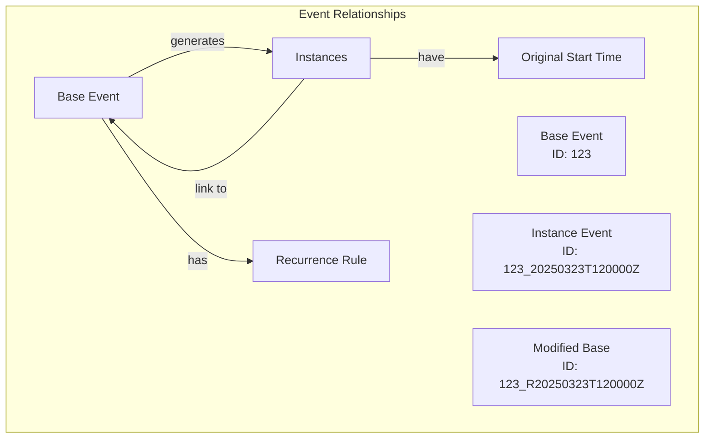

# Recurring Events - Overview

## Core Concepts

### What is a Recurring Event?

A recurring event in Google Calendar consists of:

- **Base event** that defines the pattern (e.g., "Weekly Meeting every Monday at 2pm")
  - Base event: has `recurrence.eventId` AND `recurrence.rule` (e.g., "RRULE:FREQ=WEEKLY")
  - `recurrence.eventId` === `gEventId`
- **Instances**: Individual occurrences that follow that pattern (e.g., individual meetings on specific Mondays)
  - Instance: has `recurrence.eventId` AND NOT `recurrence.rule`
- **Recurrence Rule**: Defines how the event repeats (frequency, interval, exceptions)
- **Original Start Time**: The time an instance was originally scheduled for (important when instances are modified)

Think of it like a template (base event) that generates individual events (instances) based on a rule.

### Event Relationships

## Common Operations

### Creating a Recurring Event

When a user creates a recurring event:

1. Google Calendar creates a base event with a recurrence rule
2. The base event serves as a template for generating instances
3. Instances are generated based on the rule (e.g., weekly, daily, monthly)

### Modifying Recurring Events

There are three main ways to modify a recurring event:

1. **Edit One Instance**

   - Changes only a specific occurrence
   - The instance becomes "customized" and no longer follows the base event's pattern
   - Other instances remain unchanged

2. **Edit This and Following**

   - Changes an instance and all future instances
   - Creates a new series starting from the modified instance
   - Original series ends before the modified instance
   - Think of it like splitting a series into two parts

3. **Edit All Instances**
   - Changes the entire series
   - Creates a new series with the updated pattern
   - Original series is ended
   - All instances are updated to match the new pattern

### Deleting Recurring Events

There are three ways to delete recurring events:

1. **Delete One Instance**

   - Removes a single occurrence
   - Other instances remain unchanged
   - The instance is marked as "cancelled"

2. **Delete This and Following**

   - Removes an instance and all future instances
   - Original series ends before the deleted instance
   - Similar to "Edit This and Following" but with deletion

3. **Delete All Instances**
   - Removes the entire series
   - All instances are marked as "cancelled"
   - Base event is removed

## Technical Details

### Event Identification

Google Calendar uses specific ID patterns to identify events:

- Base events: Simple IDs (e.g., `123`)
- Instances: IDs with timestamps (e.g., `123_20250323T120000Z`)
- New base events after modifications: IDs with `_R` suffix (e.g., `123_R20250323T120000Z`)

### Recurrence Rules

- Use the RRULE format (e.g., `RRULE:FREQ=WEEKLY`)
- Can include exceptions and modifications
- `UNTIL` rule indicates when a series ends
- Rules can be complex (e.g., "every other Monday except holidays")

### Relationships Between Events

- Instances link to their base event via `recurringEventId`
- Modified instances keep their `originalStartTime`
- `iCalUID` remains constant across modifications

## Common Pitfalls

1. **Instance Modifications**

   - Modified instances become independent of the base event
   - They need to be tracked separately
   - Original start time is crucial for identification

2. **Series Splits**

   - When editing "this and following", you get two series
   - Need to handle both the ending of the old series and creation of the new one
   - Timing of the split is important

3. **Deletion Handling**
   - Cancelled instances still exist in the API
   - Need to distinguish between different types of deletions
   - Series modifications can look similar to deletions

## Best Practices

1. **Always Track Original Times**

   - Keep track of original start times for instances
   - Helps identify instances even after modifications

2. **Handle Series Modifications Carefully**

   - Check for UNTIL rules to identify series endings
   - Look for new base events with `_R` suffix
   - Preserve original series data until new series is confirmed

3. **Consider Performance**

   - Limit instance expansion to reasonable time windows
   - Batch database operations when possible
   - Cache frequently accessed series data

4. **Error Handling**
   - Validate recurrence rules
   - Handle missing or malformed data gracefully
   - Consider timezone implications

## Common Questions

1. **Why do we need both base events and instances?**

   - Base events define the pattern
   - Instances represent actual occurrences
   - Allows for individual instance modifications

2. **What happens when an instance is modified?**

   - It becomes independent of the base event
   - Original start time is preserved
   - Other instances remain unchanged

3. **How do we handle series splits?**

   - Original series ends before the split point
   - New series starts from the split point
   - Both series need to be managed

4. **Why keep cancelled instances?**
   - Helps maintain history
   - Allows for potential restoration
   - Maintains relationships between events
