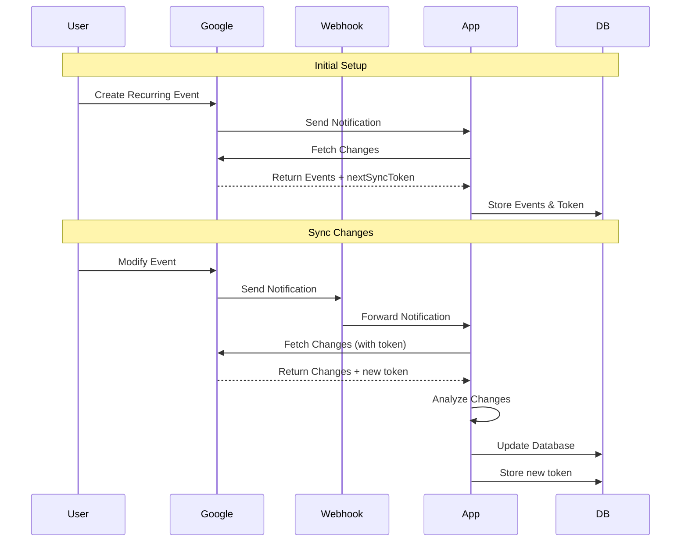
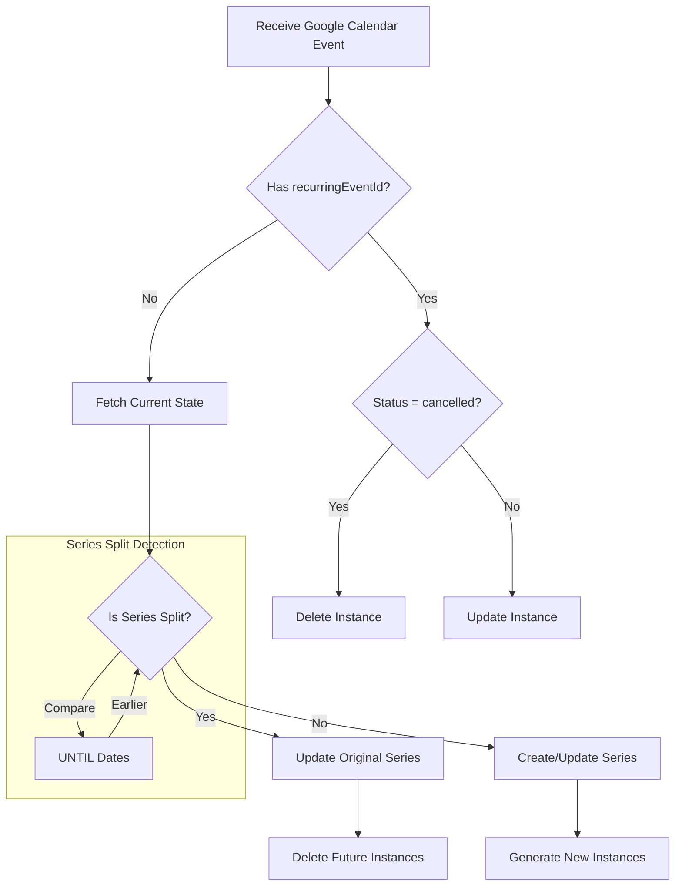
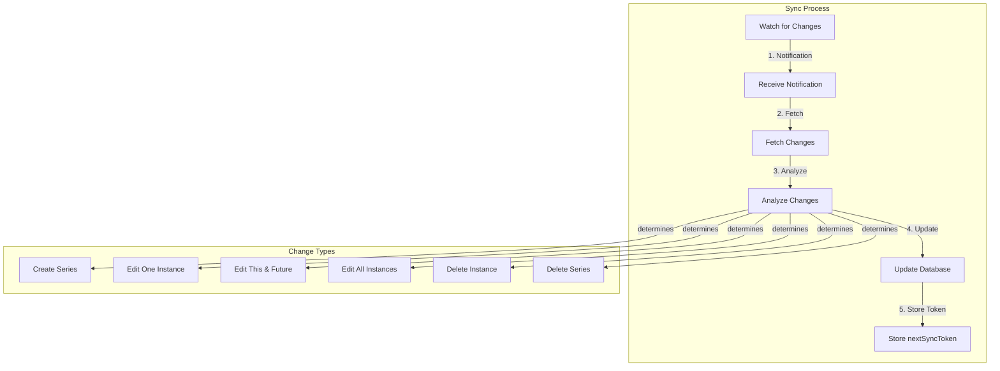

# Recurring Events - Sync

## Synchronization Workflow

### Overview

Synchronizing recurring events with Google Calendar involves:

1. Initial setup and watching for changes
2. Receiving notifications when changes occur
3. Fetching the changed events
4. Analyzing the changes
5. Updating your database accordingly

### Initial Setup

1. **Watch for Changes**

   - Set up a webhook to receive notifications from Google Calendar
   - Store the `nextSyncToken` from the initial sync
   - This token is crucial for incremental updates

2. **Initial Sync**
   - Fetch all events for the calendar
   - Store the final `nextSyncToken` for future use
   - This establishes your baseline state

### Change Detection

When changes occur in Google Calendar:

1. **Notification Received**

   - Google sends a notification to your webhook
   - The notification indicates which calendar changed
   - No event details are included in the notification

2. **Fetch Changes**
   - Use the stored `nextSyncToken` to fetch only changed events
   - Google returns:
     - Modified events
     - New events
     - Deleted events (marked as "cancelled")
     - A new `nextSyncToken` for the next sync

## Splitting Series

### Problem Summary

When users modify recurring events in Google Calendar using "this and following" operations, we need to handle the resulting series splits in our sync system. These splits can occur in two scenarios:

1. Delete "this and following" - splits the series and deletes future instances

2. Edit "this and following" - splits the series and creates a new series with modified properties

The challenge is that Google Calendar's API sends these changes in potentially multiple payloads, and we can't rely on receiving all related changes in a single payload or in a specific order.

### Solution Overview

Treat each change as an independent operation based on the event's properties, not on payload combinations or ID patterns. This approach is more reliable as it:

1. Uses documented API properties

2. Doesn't rely on payload ordering

3. Handles each change atomically

4. Works consistently across all operation types

### Approach

Whenever a series is split, delete the following instances

- Don't worry about what caused the split -- differentiating between editing 'this and following' vs deleting 'this and following'

Has recurrence with UNTIL? → Original series being split
Has recurringEventId? → Instance or new series
Has status: "cancelled"? → Cancelled instance
Has originalStartTime? → Modified instance

### Design Flow: Detecting Series Splits

## Tradeoffs

### Pros

1. **Reliability**: Uses documented API properties instead of ID patterns

2. **Simplicity**: Each operation is self-contained

3. **Consistency**: Works the same way regardless of payload ordering

4. **Maintainability**: Clear separation of concerns

### Cons

1. **Multiple Operations**: May require multiple database operations for a single user action

2. **No Atomicity**: Changes are processed independently, which could lead to temporary inconsistencies

3. **No Context**: Can't optimize based on knowing the full user action

## Risks and Mitigations

1. **Race Conditions**:

   - Risk: If payloads arrive out of order, we might process them in an unexpected sequence

   - Mitigation: Use database transactions for related operations

   - Mitigation: Implement idempotent operations

2. **Incomplete Operations**:

   - Risk: If a payload is lost, we might end up with an incomplete split

   - Mitigation: Implement periodic consistency checks

   - Mitigation: Compare instance lists derived from rules vs stored instances

3. **Time Zone Issues**:

   - Risk: Incorrect handling of DST transitions and timezone conversions

   - Mitigation: Always use event's specified timezone for date operations

   - Mitigation: Handle UNTIL dates as end-of-day in event's timezone

4. **Edge Cases**:

   - Risk: Unhandled scenarios like splitting first instance or series with exceptions

   - Mitigation: Comprehensive test coverage

   - Mitigation: Clear documentation of expected behavior

## Future Considerations

1. **Error Recovery**:

   - Implement periodic consistency checks

   - Add monitoring for incomplete splits

   - Create repair tools for manual intervention

2. **Performance Optimization**:

   - Consider batching related operations

   - Implement caching for frequently accessed events

   - Optimize database queries for instance operations

3. **Monitoring**:

   - Track split operations and success rates

   - Monitor timezone-related issues

   - Alert on potential inconsistencies

4. **Testing**:

   - Comprehensive test coverage for all scenarios

   - Timezone transition tests

   - Edge case simulation

   - Integration tests with Google Calendar API

### Anti-Pattern Design Flow

We're sharing this flawed approach because it seems like a logical way to approach the problem, but it doesn't work. Do not do this.

The flawed assumption is that you will be able to determine the user's action based on the payloads
that you receive from Google Calendar after a notification is received. Unfortunately, this is not the case.
Google Calendar API batches changes, and does not return them in a way that corresponds to what
caused the change.

Because of this, you are better off treating each change as an independent operation, without regard
for what caused the change.
