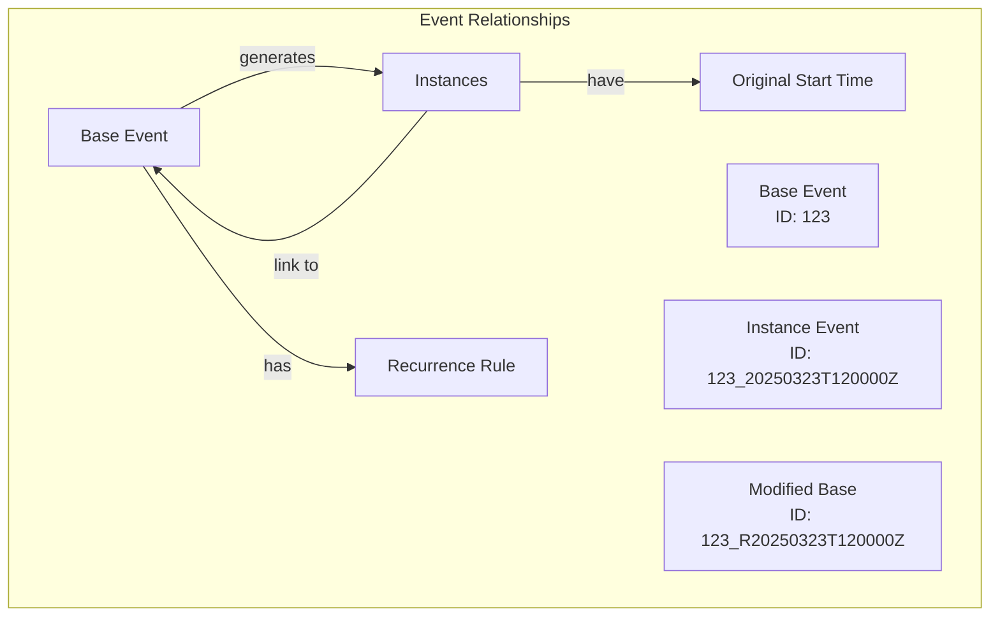
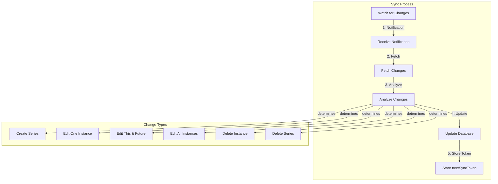
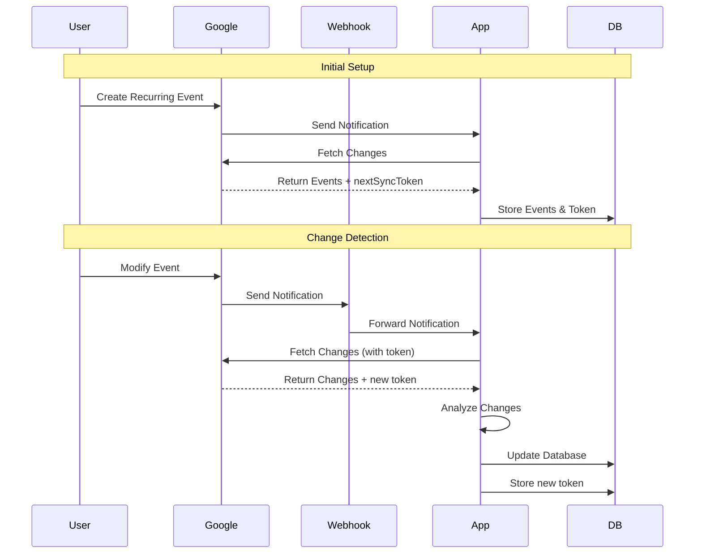
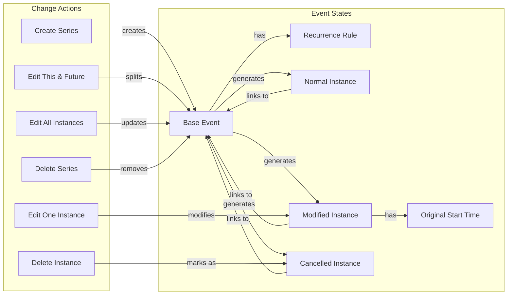

# Recurring Events

## Core Concepts

### What is a Recurring Event?

A recurring event in Google Calendar consists of:

- **Base event** that defines the pattern (e.g., "Weekly Meeting every Monday at 2pm")
  - Base event: has `recurrence.eventId` AND `recurrence.rule` (e.g., "RRULE:FREQ=WEEKLY")
  - `recurrence.eventId` === `gEventId`
- **Instances**: Individual occurrences that follow that pattern (e.g., individual meetings on specific Mondays)
  - Instance: has `recurrence.eventId` AND NOT `recurrence.rule`
- **Recurrence Rule**: Defines how the event repeats (frequency, interval, exceptions)
- **Original Start Time**: The time an instance was originally scheduled for (important when instances are modified)

Think of it like a template (base event) that generates individual events (instances) based on a rule.


## Event Relationships and Workflow









## Common Operations

### Creating a Recurring Event

When a user creates a recurring event:

1. Google Calendar creates a base event with a recurrence rule
2. The base event serves as a template for generating instances
3. Instances are generated based on the rule (e.g., weekly, daily, monthly)

### Modifying Recurring Events

There are three main ways to modify a recurring event:

1. **Edit One Instance**

   - Changes only a specific occurrence
   - The instance becomes "customized" and no longer follows the base event's pattern
   - Other instances remain unchanged

2. **Edit This and Following**

   - Changes an instance and all future instances
   - Creates a new series starting from the modified instance
   - Original series ends before the modified instance
   - Think of it like splitting a series into two parts

3. **Edit All Instances**
   - Changes the entire series
   - Creates a new series with the updated pattern
   - Original series is ended
   - All instances are updated to match the new pattern

### Deleting Recurring Events

There are three ways to delete recurring events:

1. **Delete One Instance**

   - Removes a single occurrence
   - Other instances remain unchanged
   - The instance is marked as "cancelled"

2. **Delete This and Following**

   - Removes an instance and all future instances
   - Original series ends before the deleted instance
   - Similar to "Edit This and Following" but with deletion

3. **Delete All Instances**
   - Removes the entire series
   - All instances are marked as "cancelled"
   - Base event is removed

## Technical Details

### Event Identification

Google Calendar uses specific ID patterns to identify events:

- Base events: Simple IDs (e.g., `123`)
- Instances: IDs with timestamps (e.g., `123_20250323T120000Z`)
- New base events after modifications: IDs with `_R` suffix (e.g., `123_R20250323T120000Z`)

### Recurrence Rules

- Use the RRULE format (e.g., `RRULE:FREQ=WEEKLY`)
- Can include exceptions and modifications
- `UNTIL` rule indicates when a series ends
- Rules can be complex (e.g., "every other Monday except holidays")

### Relationships Between Events

- Instances link to their base event via `recurringEventId`
- Modified instances keep their `originalStartTime`
- `iCalUID` remains constant across modifications

## Common Pitfalls

1. **Instance Modifications**

   - Modified instances become independent of the base event
   - They need to be tracked separately
   - Original start time is crucial for identification

2. **Series Splits**

   - When editing "this and following", you get two series
   - Need to handle both the ending of the old series and creation of the new one
   - Timing of the split is important

3. **Deletion Handling**
   - Cancelled instances still exist in the API
   - Need to distinguish between different types of deletions
   - Series modifications can look similar to deletions

## Best Practices

1. **Always Track Original Times**

   - Keep track of original start times for instances
   - Helps identify instances even after modifications

2. **Handle Series Modifications Carefully**

   - Check for UNTIL rules to identify series endings
   - Look for new base events with `_R` suffix
   - Preserve original series data until new series is confirmed

3. **Consider Performance**

   - Limit instance expansion to reasonable time windows
   - Batch database operations when possible
   - Cache frequently accessed series data

4. **Error Handling**
   - Validate recurrence rules
   - Handle missing or malformed data gracefully
   - Consider timezone implications

## Common Questions

1. **Why do we need both base events and instances?**

   - Base events define the pattern
   - Instances represent actual occurrences
   - Allows for individual instance modifications

2. **What happens when an instance is modified?**

   - It becomes independent of the base event
   - Original start time is preserved
   - Other instances remain unchanged

3. **How do we handle series splits?**

   - Original series ends before the split point
   - New series starts from the split point
   - Both series need to be managed

4. **Why keep cancelled instances?**
   - Helps maintain history
   - Allows for potential restoration
   - Maintains relationships between events

## Synchronization Workflow

### Overview

Synchronizing recurring events with Google Calendar involves:

1. Initial setup and watching for changes
2. Receiving notifications when changes occur
3. Fetching the changed events
4. Analyzing the changes
5. Updating your database accordingly

### Initial Setup

1. **Watch for Changes**

   - Set up a webhook to receive notifications from Google Calendar
   - Store the `nextSyncToken` from the initial sync
   - This token is crucial for incremental updates

2. **Initial Sync**
   - Fetch all events for the calendar
   - Store the final `nextSyncToken` for future use
   - This establishes your baseline state

### Change Detection

When changes occur in Google Calendar:

1. **Notification Received**

   - Google sends a notification to your webhook
   - The notification indicates which calendar changed
   - No event details are included in the notification

2. **Fetch Changes**
   - Use the stored `nextSyncToken` to fetch only changed events
   - Google returns:
     - Modified events
     - New events
     - Deleted events (marked as "cancelled")
     - A new `nextSyncToken` for the next sync

### Payload Analysis

When you receive events from Google Calendar, they follow these patterns:

| Change Type        | Payload Contents                             | Key Indicators                                                                                                           |
| ------------------ | -------------------------------------------- | ------------------------------------------------------------------------------------------------------------------------ |
| New Recurring      | Single base event with `recurrence` rule     | - Only contains the base\n- Has `recurrence` rule\n- No instance events                                                  |
| Edit One Instance  | Base event + modified instance               | - Instance has `_` in ID\n- Has `recurringEventId`\n- No `recurrence` rule\n- Other instances unchanged                  |
| Edit This & Future | Original base + modified instance + new base | - Original base has `UNTIL` rule\n- Modified instance\n- New base with `_R` suffix\n- New base has new `recurrence` rule |
| Edit All Instances | Modified base + new base                     | - Base has `UNTIL` rule\n- New base with `_R` suffix\n- All instances updated                                            |
| Delete Instance    | Base event + cancelled instance              | - Instance marked as "cancelled"\n- Has `recurringEventId`\n- Base event unchanged                                       |
| Delete Series      | All instances marked as "cancelled"          | - No base event\n- All events marked as "cancelled"\n- All have same `recurringEventId`                                  |

### Database Updates

After analyzing the payload:

1. **Determine Action**

   - Use the payload patterns to identify the type of change
   - Choose the appropriate action (CREATE, UPDATE, DELETE)

2. **Update Database**

   - Apply the action to your database
   - Maintain relationships between events
   - Handle any necessary cleanup

3. **Update Sync Token**
   - Store the new `nextSyncToken` from Google
   - Use it for the next sync operation

## Example Implementation

Here's a simplified example of how to implement this workflow:

```typescript
// Types for our sync system
interface SyncState {
  nextSyncToken: string;
  calendarId: string;
}

interface ChangeNotification {
  resourceId: string;
  resourceState: "exists" | "not_exists";
  channelId: string;
}

// Main sync service
class CalendarSyncService {
  private syncState: SyncState;

  // Handle notification from Google
  async handleNotification(notification: ChangeNotification) {
    // 1. Fetch changes using stored sync token
    const changes = await this.fetchChanges(this.syncState.nextSyncToken);

    // 2. Analyze the changes
    const analysis = this.analyzeChanges(changes);

    // 3. Update database based on analysis
    await this.updateDatabase(analysis);

    // 4. Update sync token
    this.syncState.nextSyncToken = changes.nextSyncToken;
  }

  // Fetch changes from Google Calendar
  private async fetchChanges(syncToken: string) {
    const response = await google.calendar.events.list({
      calendarId: this.syncState.calendarId,
      syncToken,
      singleEvents: true, // Important for recurring events
    });

    return {
      events: response.data.items,
      nextSyncToken: response.data.nextSyncToken,
    };
  }

  // Analyze changes to determine action
  private analyzeChanges(changes: gSchema$Event[]): ActionAnalysis {
    // Find base event and instances
    const baseEvent = changes.find(
      (event) => event.recurrence && !event.recurringEventId
    );
    const instances = changes.filter((event) => event.recurringEventId);

    // Check for cancelled events
    const cancelledEvents = changes.filter(
      (event) => event.status === "cancelled"
    );

    // Determine the type of change
    if (changes.length === 1 && baseEvent?.recurrence) {
      return { action: "CREATE_SERIES", baseEvent };
    }

    if (!baseEvent && cancelledEvents.length === changes.length) {
      return { action: "DELETE_SERIES" };
    }

    if (baseEvent && cancelledEvents.length > 0) {
      return {
        action: "DELETE_INSTANCES",
        baseEvent,
        modifiedInstance: cancelledEvents[0],
      };
    }

    // ... handle other cases ...

    throw new Error("Unable to determine change type");
  }

  // Update database based on analysis
  private async updateDatabase(analysis: ActionAnalysis) {
    switch (analysis.action) {
      case "CREATE_SERIES":
        await this.createSeries(analysis.baseEvent);
        break;
      case "DELETE_SERIES":
        await this.deleteSeries(analysis.baseEvent?.id);
        break;
      case "DELETE_INSTANCES":
        await this.deleteInstances(
          analysis.baseEvent?.id,
          analysis.modifiedInstance
        );
        break;
      // ... handle other cases ...
    }
  }

  // Helper methods for database operations
  private async createSeries(baseEvent: gSchema$Event) {
    // Store base event
    await db.events.insert(baseEvent);

    // Generate and store instances
    const instances = await this.generateInstances(baseEvent);
    await db.events.insertMany(instances);
  }

  private async deleteSeries(baseEventId: string) {
    // Delete all events with this base event ID
    await db.events.deleteMany({
      $or: [{ id: baseEventId }, { recurringEventId: baseEventId }],
    });
  }

  private async deleteInstances(
    baseEventId: string,
    cancelledInstance: gSchema$Event
  ) {
    // Mark instance as cancelled in database
    await db.events.updateOne(
      { id: cancelledInstance.id },
      { $set: { status: "cancelled" } }
    );
  }
}
```

This example shows:

1. How to handle notifications from Google
2. How to fetch changes using sync tokens
3. How to analyze changes to determine the appropriate action
4. How to update your database based on the analysis

Key points to remember:

- Always use `singleEvents: true` when fetching events
- Keep track of sync tokens
- Handle all possible change types
- Maintain relationships between events
- Consider performance when dealing with many instances
