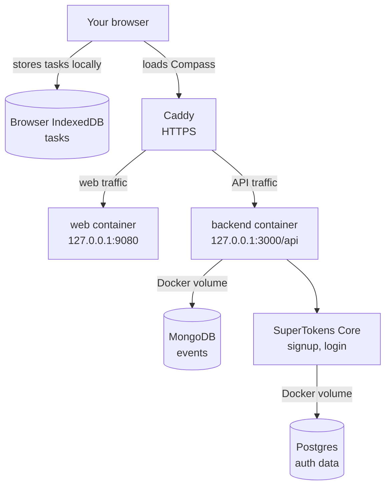

# Self-Hosting

You can run Compass on infrastructure you control instead of using the hosted version on `compasscalendar.com`

Start with [Run Compass on a server](./server-guide.md). It walks through a small VPS setup with your own domain, HTTPS, and the Compass services running behind a reverse proxy.

If you only want to run Compass on your own computer, use the normal local development flow with Bun instead of the self-host installer.

## Compass architecture

When you self-host Compass on a server, you get a stack of small services. Only the public website and API are reachable from your browser. The databases stay private inside Docker.

## Start here

Ready to get this setup on your infrastructure? See [Run Compass on a server](./server-guide.md)

----

Have an idea on how we can make self-hosting easier? Let us know in [this GitHub Discussion](https://github.com/SwitchbackTech/compass/discussions/1694).
